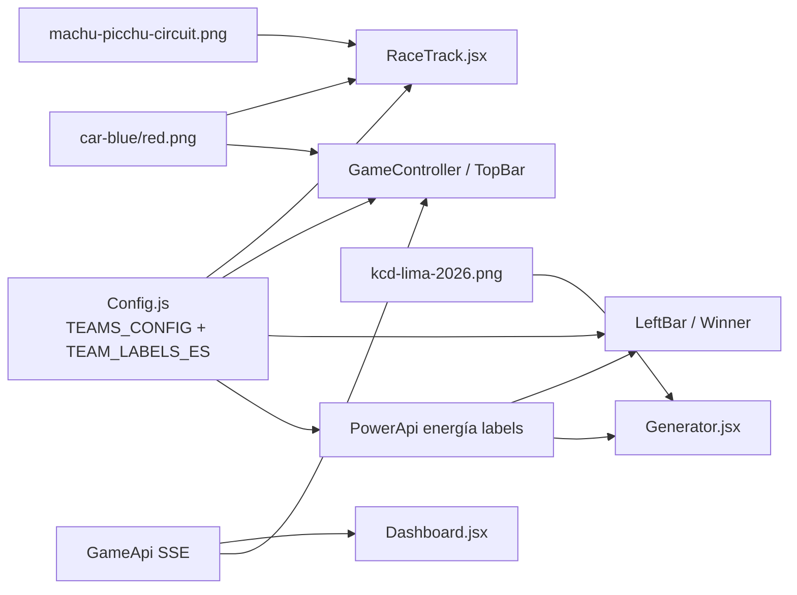

# Design: KCD Lima Chasquis Theme — GitLab Wind Turbine Skeleton

## Technical Approach

Frontend-only port: copy 16 source files verbatim from `/home/fmeneses/Documents/demos/quinoa-wind-turbine/` into `scaffolder-templates/gitlab/quinoa-wind-turbine/skeleton/`, plus 5 KCD assets and `scripts/generate-kcd-assets.py`. Backend Java, `template.yaml`, manifests, and GitHub skeleton stay untouched. Source of truth is the applied demo app (post-`kcd-lima-chasquis-theme`), not the archived 777×518 design — the demo evolved to 1024×682 circuit dimensions and recalibrated `offset-path` values.

**Boundary**: skeleton-only Phase 1; RHDH catalog, `template-dry-run.yaml`, and GitLab Kind wiring are Phase 2.

## Architecture Decisions

| Decision | Choice | Alternatives rejected | Rationale |
|----------|--------|----------------------|-----------|
| Port strategy | Direct file copy from demo app | Manual re-edit from archived specs | Demo is canonical; eliminates drift on offset-path, Dashboard winner timing, GameApi SSE behavior |
| Asset delivery | Copy committed PNGs from demo + commit regeneration script | Script-only generation | Script outputs 777×518 circuit; committed `machu-picchu-circuit.png` is 1024×682. `kcd-lima-2026.png` is not script-generated — must copy |
| Circuit calibration | Port exact 1024×682 viewBox + scaled offset-paths | Reuse skeleton 777×518 paths | Paths are proportional to circuit size; skeleton paths misalign on Machu Picchu asset |
| Mobile generator | `Generator.jsx` uses `kcd-lima-2026.png` badge | Inline SVG in `Turbine.jsx` (archived design) | Demo implementation replaced turbine SVG with KCD badge image |
| Scope | GitLab skeleton only | Sync GitHub `scaffolder-templates/quinoa-wind-turbine/` | Aligns with planned GitLab Kind stack; avoids cross-variant review budget |
| Backend | No Java changes | Port `PowerResource` unused-import cleanup | Only diff is a removed unused Kafka import in skeleton — theme-independent; leave skeleton backend as-is |

## Data Flow



Runtime path unchanged: operator starts game via REST → Kafka power events → SSE updates `offset-distance` on dashboard sprites; mobile taps POST `/api/power`.

## File Changes

| Source (demo app) | Destination (GitLab skeleton) | Action |
|-------------------|-------------------------------|--------|
| `src/main/webui/src/Config.js` | same path under skeleton | Modify |
| `src/main/webui/src/components/Dashboard/{LeftBar,Winner,RaceTrack,Dashboard}.jsx` | same | Modify |
| `src/main/webui/src/components/GameController/{ChooseTeamModal,TopBar,GameController,Generator,Turbine,RankModal,EnableShakingModal}.jsx` | same | Modify |
| `src/main/webui/src/api/{PowerApi,GameApi}.js` | same | Modify |
| `src/main/webui/index.html` | same | Modify |
| `src/main/webui/public/manifest.json` | same | Modify |
| `src/main/webui/public/{machu-picchu-circuit,car-blue,car-red,favicon,kcd-lima-2026}.png` + `.ico` | `public/` | Create/replace |
| `scripts/generate-kcd-assets.py` | `skeleton/scripts/` | Create |

**Unchanged**: `src/main/java/org/acme/*` (verified — only cosmetic import diff), Login, `index.css`, `App.jsx`, `Shake.js`, `Sensors.js`, `StopWatch.jsx`, `DashboardUtils.js`, `template.yaml`, `manifests/`, `catalog-info.yaml`.

**Legacy assets retained**: `race-track-1.png`, old car PNGs — unused after port; no deletion required.

## Interfaces / Contracts

No API contract changes. Frontend-only deltas:

```javascript
// Config.js — team identity
export const TEAMS_CONFIG = [{ name: 'Blue Team', color: '#2E6DA4', car: 'car-blue' }, ...];
export const TEAM_LABELS_ES = ['Equipo Azul', 'Equipo Rojo'];
export const NB_TAP_NEEDED_PER_USER = 100;

// PowerApi.js — flat energía units (no MW/KW scaling)
const ENERGY_LABEL = 'energía';

// RaceTrack.jsx — 1024×682 viewBox, transform-origin 35px 60px
```

## Testing Strategy

| Layer | What to test | Approach |
|-------|-------------|----------|
| Diff fidelity | 16 frontend files match demo | `diff -q` per file against source app |
| Backend guard | No Java regressions | `diff -rq src/main/java` — expect match (ignore unused-import cosmetic) |
| Smoke | App boots, assets serve | `cd skeleton && ./mvnw quarkus:dev`; Network tab: 5 KCD assets HTTP 200 |
| Visual | Dashboard circuit + sprites | `/dashboard` — Machu Picchu background, chasquis on path, Spanish copy |
| Visual | Mobile player | `/` — team modal ES, `kcd-lima-2026.png` badge tap, energía counter |
| Residual EN | No visible English strings | `grep` UI strings; allow code identifiers only |

No root repo test runner. Optional: `./mvnw test` inside skeleton if time permits.

## Threat Matrix

N/A — no routing, shell, subprocess, VCS/PR automation, executable-file classification, or process-integration boundary. Frontend theme port only.

## Migration / Rollout

No migration required. Rollback: `git revert` or `git checkout` on `scaffolder-templates/gitlab/quinoa-wind-turbine/skeleton/`.

## Open Questions

- [ ] Update `generate-kcd-assets.py` to emit 1024×682 circuit (currently 777×518) — defer unless regeneration needed pre-event
- [ ] Remove unused legacy car/track PNGs from `public/` — cosmetic cleanup, out of scope
