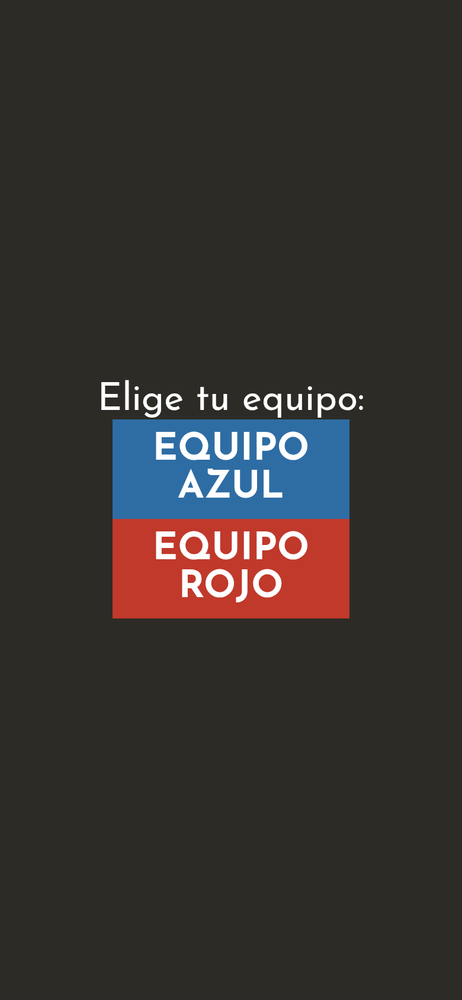
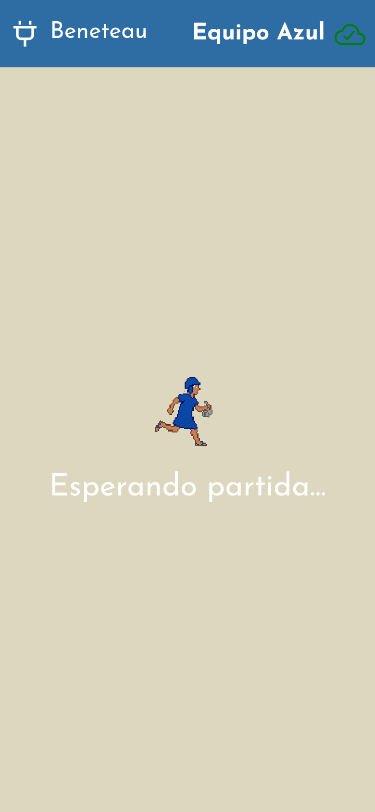
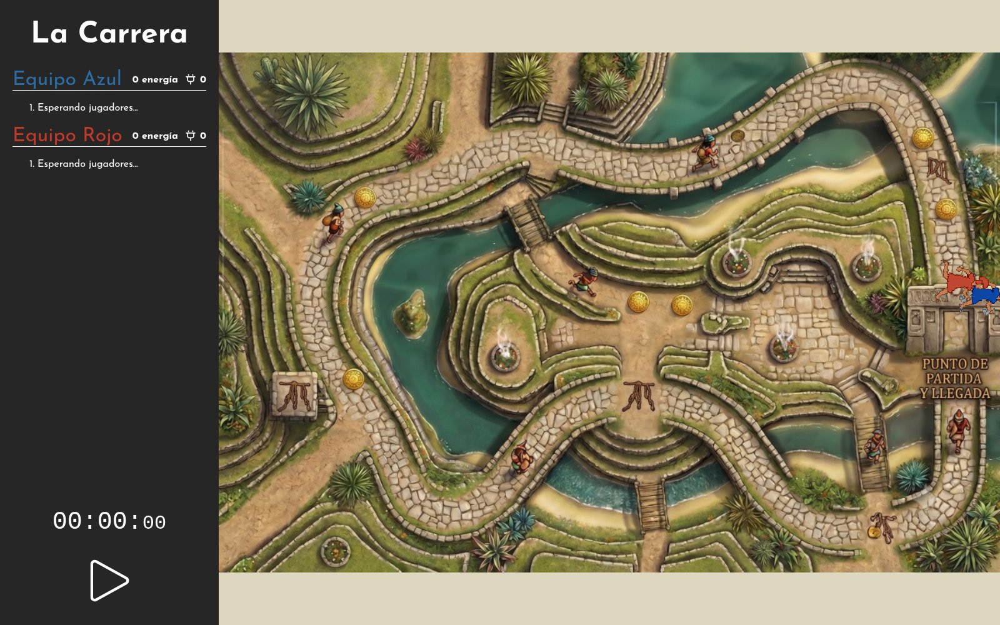
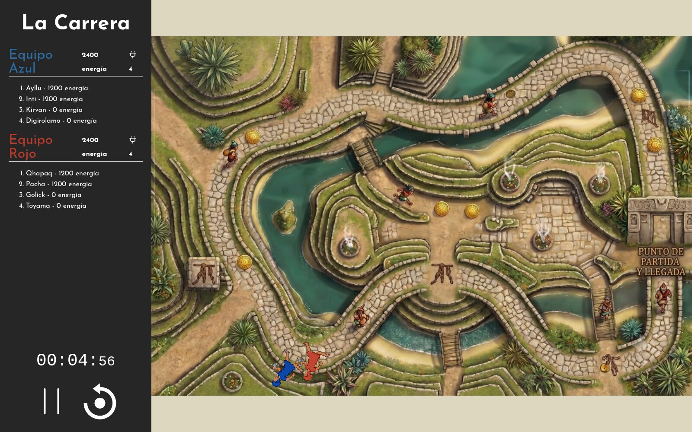
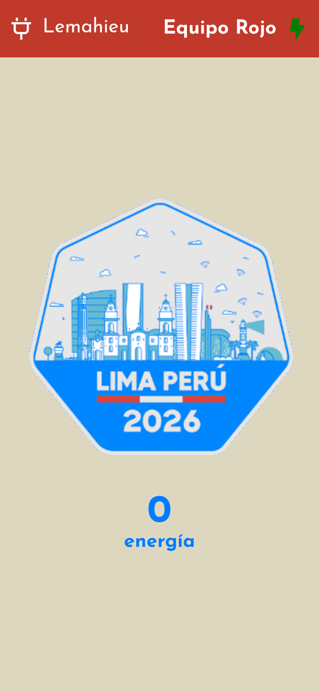
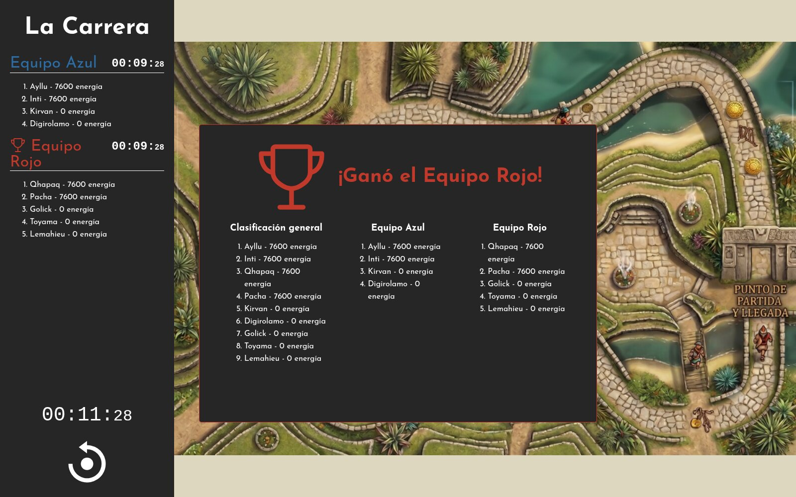
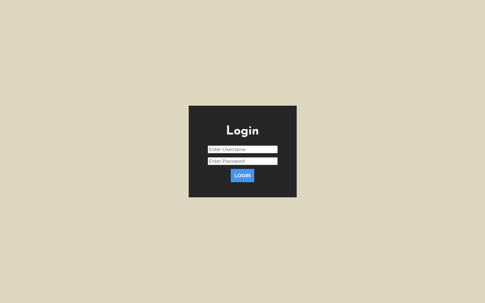
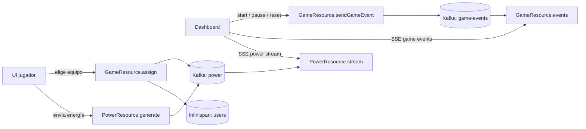

# KCD Lima — Carrera de Chasquis

Demo Quarkus + Quinoa: carrera en equipo alrededor de Machu Picchu. Los jugadores se unen desde el móvil, generan energía y el dashboard muestra la carrera en vivo.

## El juego

Antes de arrancar, los jugadores eligen equipo y esperan la partida.





El operador usa el dashboard para iniciar la carrera.



Durante la carrera, ambos equipos generan energía y los chasquis avanzan por el circuito.



En el móvil, los jugadores tocan el badge para enviar energía.



Al final, el dashboard muestra el equipo ganador y la clasificación.



### Dashboard (login)

La pantalla `/dashboard` está protegida. Credenciales por defecto:

- Usuario: `developer`
- Password: `kcdlima2026`



## Arquitectura

Hay dos entradas en el navegador: la UI del jugador (`/`) y el dashboard del operador (`/dashboard`). Ambas hablan con el backend Quarkus. El estado del juego y la energía van por Kafka; Infinispan guarda contadores y estado compartido.



## Correr en modo dev

Necesitas JDK 17+ (recomendado 21).

```bash
./mvnw quarkus:dev
```

- Jugadores: http://localhost:8080/
- Dashboard: http://localhost:8080/dashboard

### Probar sin muchos móviles

Con la app en dev, puedes cargar jugadores con el script jbang:

```bash
jbang scripts/GameLoader.java http://localhost:8080
```

Abre el dashboard y pulsa play mientras corre el script.

## Personalizar

Config principal: [`src/main/webui/src/Config.js`](src/main/webui/src/Config.js)

- `TEAMS_CONFIG` / `TEAM_LABELS_ES` — nombres, colores y sprites
- `TAP_POWER`, `NB_TAP_NEEDED_PER_USER` — dinámica de la carrera
- `ENABLE_TAPPING` / `ENABLE_SHAKING` / … — controles del jugador

## Contenedor

```bash
./mvnw package
docker build -f src/main/docker/Dockerfile.jvm -t kcd-lima-app .
docker run --rm -p 8080:8080 kcd-lima-app
```

En Kind (demo KCD), la imagen se publica a GHCR y Argo CD la sincroniza desde el repo GitOps generado por el template de Backstage.

## Más docs

- TechDocs: [`docs/index.md`](docs/index.md)

## Agentic / OpenSpec

This repo includes Cursor OpenSpec/SDD tooling:

- `.cursor/skills/` — SDD phases (`sdd-init` … `sdd-archive`) and helpers
- `.cursor/rules/` — workflow + Quarkus/Chasquis conventions
- `openspec/config.yaml` — strict TDD and `./mvnw test`
- `AGENTS.md` — default agent instructions
